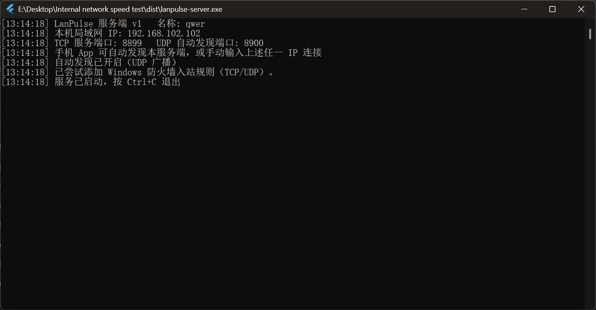
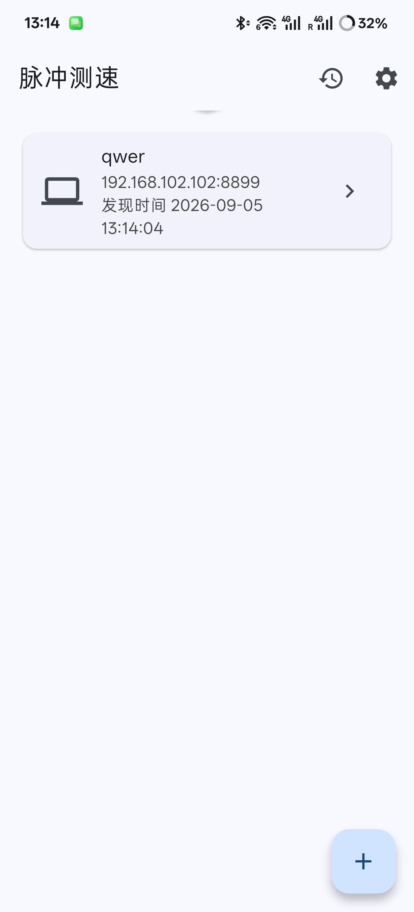
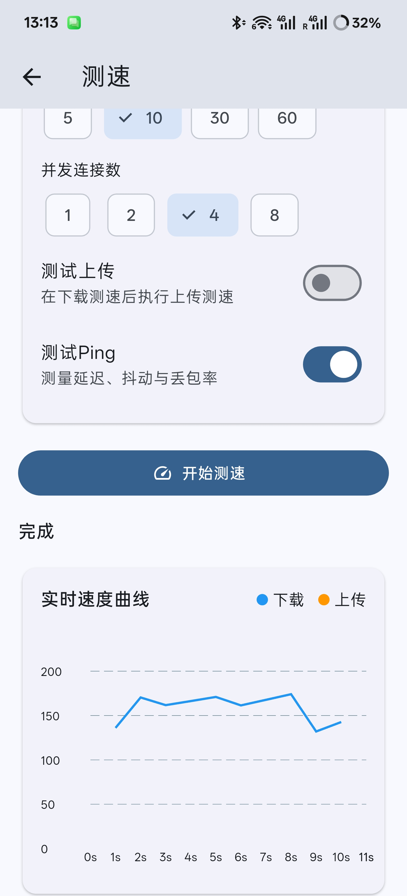
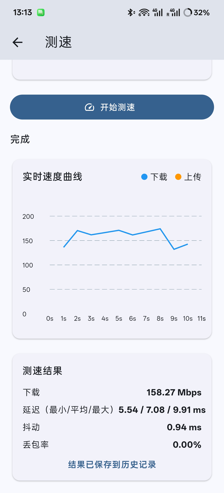

# LanPulse

[中文](./README.zh-CN.md)

A LAN speed test tool. The server runs on a PC, the app runs on a phone. It measures download speed, upload speed, latency, jitter and packet loss between the two devices over the LAN. All test traffic stays on the local network; no internet connection is used.

## Screenshots

Server startup:



| App home | Speed test | Result |
| --- | --- | --- |
|  |  |  |

## Download & Usage

Download two files from the [Releases](https://github.com/qutten/Demo/releases/latest) page:

- `lan-speed-server.exe` — the server for your PC (Windows 10/11, no Python needed)
- `lan-speed-test.apk` — the app for your phone (Android)

Then:

1. Double-click `lan-speed-server.exe` on the PC. The terminal shows the local IP and port.
2. Install `lan-speed-test.apk` on the phone.
3. Connect the phone and the PC to the same WiFi.
4. Open the app and wait for the server to appear. If it does not, tap the + at the bottom right and enter the PC's IP and port manually.
5. Pick a duration and concurrency, then tap Start.

## Metrics

| Metric | Unit | Meaning |
| --- | --- | --- |
| Download speed | Mbps | average throughput from PC to phone |
| Upload speed | Mbps | average throughput from phone to PC |
| Latency | ms | round-trip time of small packets, shown as min / avg / max |
| Jitter | ms | average difference between consecutive pings; lower is more stable |
| Packet loss | % | share of packets that got no response |

## Server

### Running

Get the exe from Releases and double-click it. The terminal shows:

```
[17:20:07] LanPulse 服务端 v1   名称: DESKTOP-ABC
[17:20:07] 本机局域网 IP: 192.168.1.5
[17:20:07] TCP 服务端口: 8899   UDP 自动发现端口: 8900
[17:20:08] 服务已启动，按 Ctrl+C 退出
```

You can also run it from source. Requires Python 3.10+:

```
cd server
python server.py
```

The exe and the source version take the same arguments.

### Arguments

| Argument | Description | Default |
| --- | --- | --- |
| `--port` | TCP service port | 8899 |
| `--discovery-port` | UDP discovery port | TCP port + 1 |
| `--name` | Server name, shown in the app | local hostname |
| `--password` | Access password | disabled |
| `--max-clients` | Maximum concurrent clients | 8 |
| `--block-size` | Data block size (bytes) | 65536 |
| `--no-announce` | Disable auto-discovery announcements | announcements on |

Example:

```
python server.py --port 9000 --password 1234 --name 我的电脑
```

### Firewall

On startup the program tries to add a Windows firewall inbound rule, which requires administrator privileges. If that fails and the phone cannot connect, allow the ports manually:

- Inbound rule: TCP 8899 (or your custom port)
- Inbound rule: UDP 8900 (auto-discovery, optional)

## Phone App

### Connecting

- Auto-discovery: with the phone and the PC on the same WiFi, the server shows up on the home page automatically. Tap it to start.
- Manual: tap + at the bottom right and enter the PC's IP and port. Use this when discovery does not work.

### Speed test

Choose a duration (5/10/30/60 s) and concurrency (1/2/4/8). You can turn off the upload test or the ping test. The speed chart updates in real time; when the test finishes, all metrics are shown and the result is saved to history (see the clock icon at the top right of the home page).

## Development & Testing

You can test the server without a phone using the test client, which simulates the phone.

Terminal 1, start the server:

```
python server.py
```

Terminal 2, run the test client:

```
python tools/test_client.py --host 127.0.0.1 --duration 5 --concurrency 4
```

`test_client.py` arguments: `--host`, `--port`, `--password`, `--duration`, `--concurrency`, `--ping-count`, `--tests` (all/ping/download/upload).

To verify auto-discovery on its own:

```
python tools/test_discovery.py
```

## Project Structure

```
├── docs/                 # screenshots
├── server/               # server source (Python)
│   ├── server.py         # entry point: startup, argument parsing
│   ├── core.py           # TCP control/data connection handling
│   ├── discovery.py      # UDP auto-discovery broadcasting
│   └── protocol.py       # protocol constants
├── app/                  # phone app Flutter project (Android)
├── tools/                # test client, etc.
├── run.bat               # one-click server start from source (Windows)
├── build_apk.bat         # for building the APK locally
└── build_server_exe.bat  # for packaging the exe locally
```
